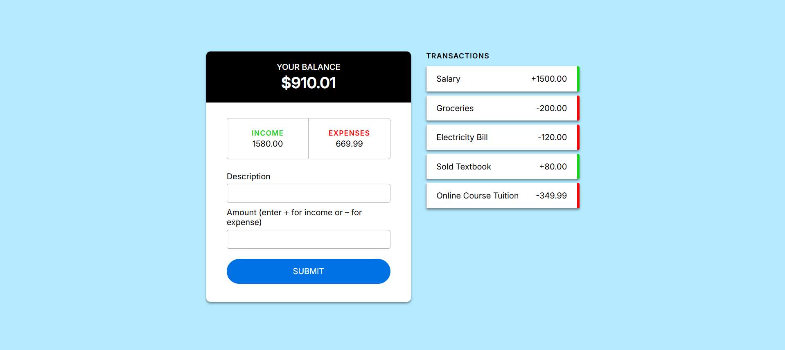

# Balance Tracker

A web-based balance tracker that lets you record income and expenses, update your balance in real-time, and remove transactions with a click.

## Features

- Add transactions with description and amount
- Use `+` for income and `–` for expenses
- View running total of income, expenses, and current balance
- Color-coded balance display (red for negative balance)
- Remove individual transactions

## Screenshot

  

## Technologies Used

- HTML
- CSS
- JavaScript
